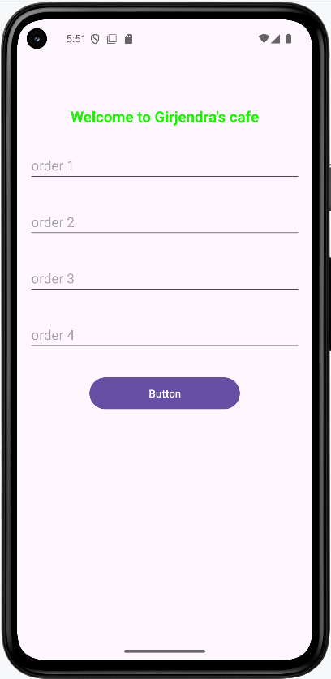
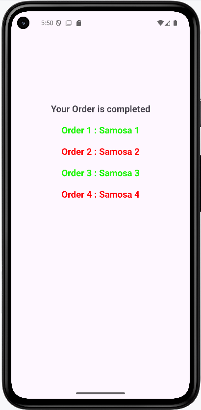

# 🍽️ Food Order App (Android)

An Android application built using **Kotlin** that allows users to enter food orders and view a summary.

---

## 🚀 Features

* Take multiple food orders
* Display order summary
* Clean and simple UI
* Color-based order indication

---

## 🛠️ Tech Stack

* Kotlin
* Android Studio
* XML Layouts

---

## 📱 Screenshots

### 🏠 Home Screen

### 📝 Order Filled Screen

### ✅ Order Summary Screen

---

## 📂 Project Structure

* `MainActivity` → Input screen
* `SecondActivity` → Order summary

---

## 🎯 Learning Outcomes

* Intent and data passing
* UI design using XML
* Android lifecycle basics

---

## ⭐ If you like this project

Give it a star ⭐ on GitHub!